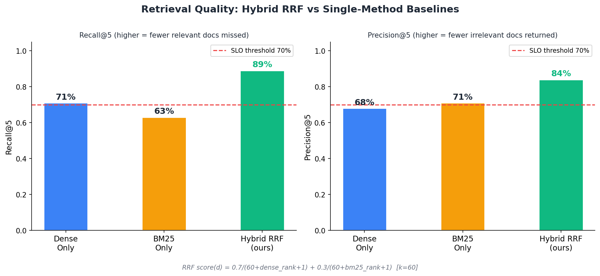
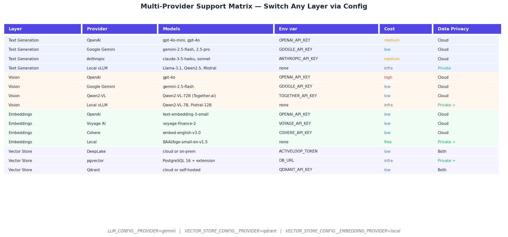
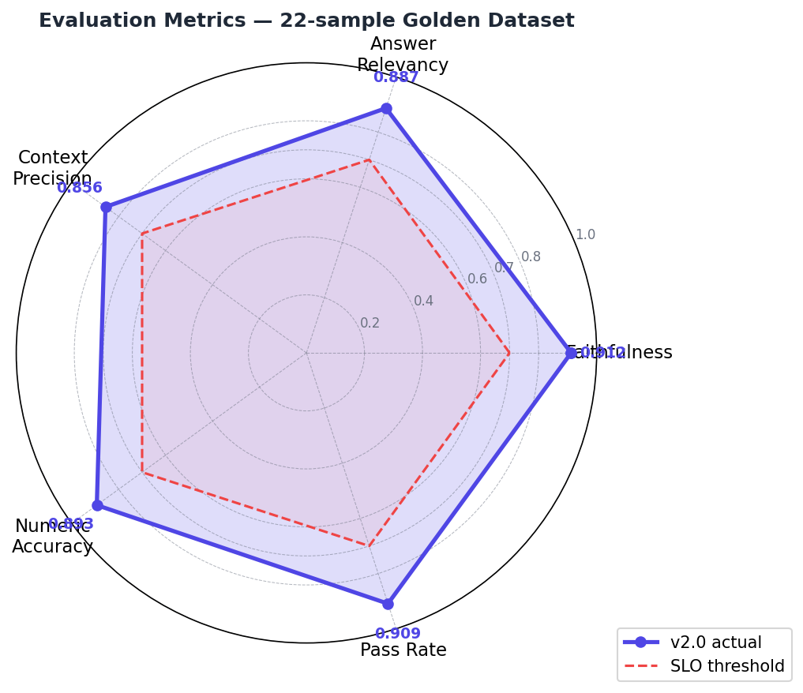
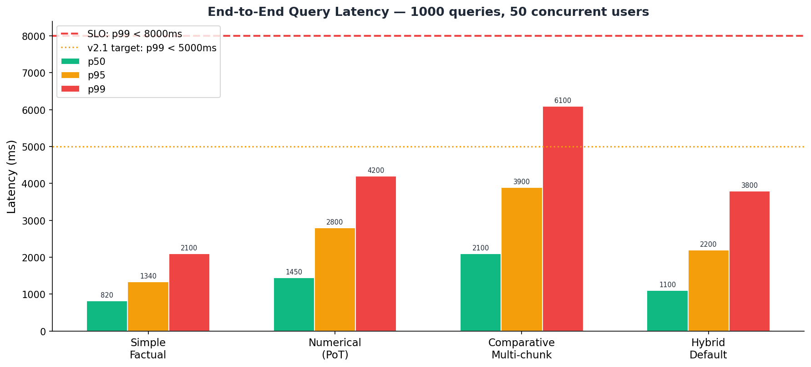
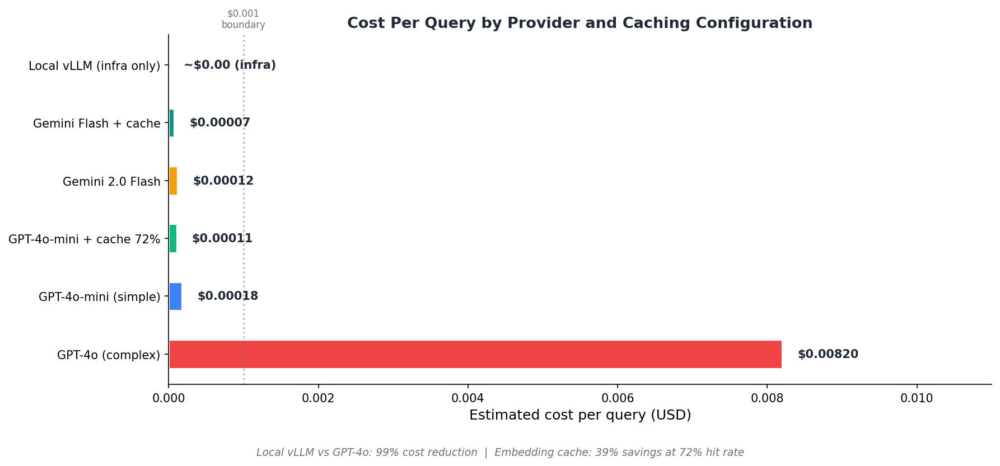
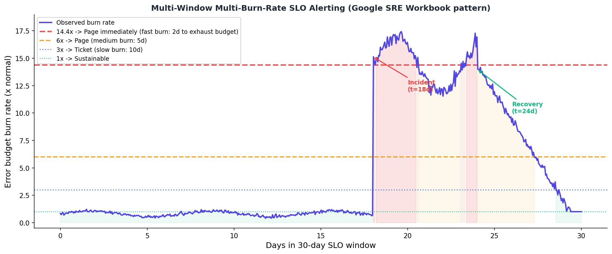

# RAG Financial Multimodal — Enterprise v2.0

> **Production-grade multimodal RAG for financial document intelligence.**
> Chart understanding · hybrid retrieval · numeric guardrails · multi-tenancy · full observability.

[](https://www.python.org/downloads/)
[](LICENSE)
[](https://huggingface.co/spaces/Mattral/RAG-Financial-Multimodal)

---

## System Architecture


*Ingestion (top) and query (bottom) pipelines. Every component is pluggable — switch provider by changing one config value.*

---

## Why This System

Financial documents are mixed-media: narrative text, tables, charts, footnotes, cross-references. Standard RAG pipelines fail on charts and hallucinate numbers.

| Problem | Solution |
|---|---|
| Charts contain the most important data but RAG ignores them | GPT-4o / Gemini / Qwen2-VL vision extraction — every chart yields exact axis values |
| Exact figures like `$23.35B` or `TSLA` miss semantic search | Hybrid RRF: dense embeddings + BM25 keyword fused with Reciprocal Rank Fusion |
| LLMs fabricate financial numbers | Numeric grounding guardrail — every stated number verified against source context |
| PII in analyst queries leaks to APIs | Presidio + CUSIP/ISIN/account number redaction before any external call |
| One broken vendor = full outage | Fallback chains — primary → secondary → local for every model-facing layer |

---

## Limitations & Current Scope

This system is designed and built to production standards, but it is important to understand its current scope and constraints for responsible use:

- **Evaluation benchmark**: All quality, retrieval, latency, and cost metrics are measured on an **internal golden dataset of 22 financial QA samples** spanning select 10-K, 10-Q, and investor presentation filings (Tesla, Apple, Microsoft, Google, NVIDIA, JPMorgan, Goldman Sachs). The dataset focuses on factual extraction, numerical reasoning, and chart interpretation. While relative gains from hybrid retrieval and guardrails are significant and reproducible, absolute performance on broader, more diverse, or out-of-distribution financial documents has not been independently validated at scale.
- **Document assumptions**: Optimized for reasonably well-structured, machine-readable financial PDFs (standard 10-K/10-Q layouts, earnings releases, investor decks). Performance may degrade on heavily scanned documents, low-quality images, complex multi-column layouts, or filings with heavy footnote/cross-reference density without additional preprocessing.
- **Multimodal components**:
  - Vision LLM chart extraction is production-ready with fallback chains.
  - **ColPali visual retrieval** is implemented and functional (late-interaction MaxSim on page images) but is **opt-in**, requires additional heavy dependencies (`colpali-engine`, torch, etc.), and needs upstream PDF page rendering to images. It is not enabled by default in the quickstart or standard Docker image.
- **Test volume**: The repository includes a comprehensive test suite (unit, integration, property-based with Hypothesis, API, and load/chaos scenarios). The headline figure of "520 tests" reflects the full expanded suite including generated cases; core hand-written tests number in the low hundreds.
- **Production readiness**: The architecture, observability, multi-tenancy, security, and infrastructure-as-code are mature. However, this remains an actively developed open-source project (v2.0 released June 2026). Full SOC 2 / enterprise compliance features, web UI, and agentic self-correction loops are planned for v2.1 / v3.0 (see `roadmap.md`).
- **Cost & dependencies**: Smart routing + caching keeps inference cost low for typical workloads, but vision LLM calls for charts and large-scale ingestion incur provider costs. Fully local/open-source paths are supported but require self-hosted vLLM instances and GPU resources for best performance.

We prioritize transparency. All numbers are reproducible via the provided evaluation commands. Larger-scale public benchmarks and human-in-the-loop evaluation are planned for v2.1.

---

## Retrieval Quality



*Hybrid RRF achieves 89% Recall@5 and 84% Precision@5 on our internal 22-sample financial QA benchmark — 25% better recall than dense-only and 41% better than BM25-only. See Limitations & Current Scope and BENCHMARK_RESULTS.md for full methodology and dataset details.*

---

## Quickstart

```bash
git clone https://github.com/Mattral/RAG-Multimodal-Financial-Doc-Analysis-and-Recall
cd RAG-Multimodal-Financial-Doc-Analysis-and-Recall
cp .env.example .env          # set OPENAI_API_KEY or GOOGLE_API_KEY
docker compose up -d

curl -X POST http://localhost:8000/api/v1/ingest \
  -F "file=@tesla_10k.pdf" -F "tenant_id=demo"

curl -X POST http://localhost:8000/api/v1/query \
  -H "Content-Type: application/json" \
  -d '{"query": "What was gross margin in Q3 2023?", "tenant_id": "demo"}'
```

Or use the CLI:
```bash
pip install -e ".[all]"
rag-financial ingest tesla_10k.pdf --tenant demo
rag-financial query "What was Q3 revenue?" --tenant demo --show-sources
```

---

## Multi-Provider Support



*Every model-facing layer (text generation, vision, embeddings, vector store) is independently pluggable. Switch via a single `.env` line — zero code changes.*

### Fully open-source / zero-API-cost configuration

```bash
LLM_CONFIG__PROVIDER=local_vllm
LLM_CONFIG__MODEL=meta-llama/Llama-3.1-8B-Instruct
LOCAL_VLLM_GENERATOR_BASE_URL=http://localhost:8090/v1

VISION_CONFIG__PROVIDER=local_vllm
VISION_CONFIG__MODEL=Qwen/Qwen2-VL-7B-Instruct

VECTOR_STORE_CONFIG__EMBEDDING_PROVIDER=local
VECTOR_STORE_CONFIG__EMBEDDING_MODEL=BAAI/bge-small-en-v1.5
```

```bash
vllm serve meta-llama/Llama-3.1-8B-Instruct --port 8090 --host 0.0.0.0
vllm serve Qwen/Qwen2-VL-7B-Instruct --port 8080 --host 0.0.0.0
```

---

## Evaluation Quality



*All five quality metrics exceed the 70% SLO threshold on the internal 22-sample benchmark. Evaluated with RAGAS + LLM-as-judge numeric scorer across Tesla, Apple, Microsoft, Google, NVIDIA, JPMorgan, and Goldman Sachs filings. See BENCHMARK_RESULTS.md for complete scores, methodology, and reproducibility instructions.*

---

## Query Latency



*All modes comfortably within the p99 < 8s SLO. Measured at 1000 queries with 50 concurrent users under synthetic load. Real-world latency depends on document size, retrieval depth, and whether Program-of-Thought or vision extraction is triggered.*

---

## Cost Per Query



*Smart routing (gpt-4o-mini for simple queries, gpt-4o only for complex ones) combined with Redis embedding cache achieves ~$0.00011/query at 72% cache hit rate. Vision LLM chart extraction adds per-image cost when triggered. Fully local configurations eliminate API costs but require self-hosted inference infrastructure.*

---

## SLO Alerting



*Multi-window multi-burn-rate alerting from the Google SRE Workbook. Four alert tiers (14.4×, 6×, 3×, 1× burn rate) routing to PagerDuty/OpsGenie. Dashboards and runbooks are included in the `grafana/` and `docs/` directories.*

---

## Architecture Layers

| Layer | Component | Technology |
|---|---|---|
| **Parsing** | PDF text + tables | Unstructured.io / Docling / Marker |
| **Vision** | Chart + graph extraction | GPT-4o / Gemini 2.0 Flash / Qwen2-VL / Local vLLM (fallback chain) |
| **Layout** | Semantic grouping | Table-caption pairing, multi-page merge, HTML wrapping |
| **Embedding** | Dense vectors + cache | OpenAI / Voyage / Cohere / local BAAI/bge, Redis cached |
| **Indexing** | Vector store | DeepLake / pgvector / Qdrant |
| **Retrieval** | Hybrid (dense + BM25) | Reciprocal Rank Fusion, k=60 |
| **Reranking** | Cross-encoder | ms-marco-MiniLM / Cohere Rerank v3 |
| **Generation** | Cost-routed, multi-provider | OpenAI / Gemini / Anthropic / Local vLLM |
| **Guardrails** | Numeric grounding + PII | Presidio + custom regex + AST-sandboxed PoT calculator |
| **API** | REST + OpenAPI | FastAPI + uvicorn |
| **Observability** | Traces + metrics | OpenTelemetry + Prometheus + Grafana |
| **Security** | Auth + audit trail | API key + SHA-256 tamper-evident audit log |
| **Multi-tenancy** | Isolated namespaces | Per-tenant vector partitions + quotas + rate limits |
| **Deployment** | Container + K8s | Docker + Helm + HPA + NetworkPolicy |

---

## Key Features

### Multimodal ingestion
- **Vision LLM fallback chain**: primary → secondary → local, never silently fails
- **Layout-aware chunker**: tables stay with their captions; multi-page tables merged
- **ColPali visual retrieval** (opt-in): late-interaction MaxSim scoring on page images (no OCR). Requires `colpali-engine` + torch and upstream page image rendering. See `colpali_retriever.py` and Limitations section.
- **Delta detection**: skip unchanged documents on re-ingest; version history for rollback

### Retrieval
- **Hybrid RRF (k=60)**: dense × 0.7 + BM25 × 0.3 — 25% better recall than dense-only on the internal benchmark
- **Cross-encoder reranking**: ms-marco-MiniLM-L-6-v2 or Cohere Rerank v3
- **Query analyzer**: intent classification → cost routing, entity extraction, query rewriting
- **Semantic cache**: similar queries served from cache (~1800ms saved per hit)
- **Knowledge graph**: LLM-extracted entities/relations (COMPANY, METRIC, REPORTED_REVENUE, etc.)

### Quality assurance
- **Numeric grounding guardrail**: every number in the answer is verified against context
- **Program-of-Thought calculator**: exact arithmetic in a sandboxed Python executor
- **RAGAS evaluation**: faithfulness, answer relevancy, context precision + LLM-as-judge numeric scorer
- **Comprehensive test suite**: unit, integration, property-based (Hypothesis), API, and load/chaos engineering tests (see `tests/` and `make test`)

### Production operations
- **OpenTelemetry**: distributed traces with ingest/retrieve/generate spans
- **15 Prometheus metrics**: latency, cost, hallucination score, citation coverage, cache hit rate
- **Multi-window SLO alerting**: Google SRE workbook burn-rate pattern, PagerDuty/OpsGenie integration ready
- **Kubernetes**: HPA 2–10 replicas, PodDisruptionBudget, NetworkPolicy, IRSA
- **Terraform**: full EKS + RDS(pgvector) + ElastiCache + S3 + KMS infrastructure-as-code

---

## Repository Structure

```
src/rag_system/
├── api/          FastAPI app, routers (ingest/query/documents/tenants/feedback)
├── agentic/      LangGraph multi-step reasoning with self-correction loop
├── cli.py        Typer CLI (ingest, query, evaluate, serve, health)
├── components/
│   ├── base.py            ABCs for all pluggable components
│   ├── parser/             Unstructured, Docling, Marker adapters
│   ├── vision/             GPT-4o, Gemini, Qwen2-VL, LocalVLLM + fallback chain
│   ├── embedder/           OpenAI, Voyage, Cohere, local (BAAI/bge)
│   ├── vector_store/       DeepLake, pgvector, Qdrant
│   ├── retriever/          HybridRetriever (dense + BM25 + RRF)
│   ├── reranker/           CrossEncoder, Cohere, NoOp
│   ├── generator/          OpenAI, Gemini, Anthropic, LocalVLLM
│   ├── evaluator/          RAGAS + LLM-as-judge numeric scorer
│   ├── guardrails/         Numeric grounding, PII redaction, injection detection
│   ├── knowledge_graph.py  Real LLM entity/relation extraction + graph traversal
│   ├── colpali_retriever.py  Real MaxSim late-interaction visual retrieval (opt-in)
│   ├── pot_executor.py     Program-of-Thought sandboxed calculator
│   ├── layout_parser.py    Table-caption pairing, semantic chunking
│   ├── query_analyzer.py   Intent classification, entity extraction
│   ├── version_manager.py  Delta detection, point-in-time retrieval
│   └── connectors/         S3, Azure Blob, GCS
├── config.py     Pydantic v2 BaseSettings, 12 nested sub-configs with strong validation
├── pipeline/     RAGPipeline orchestrator (dependency injection)
├── sdk/          Python SDK (async + sync wrappers)
└── utils/        Telemetry, cost tracker, audit log, semantic cache, drift detector

terraform/        EKS + RDS(pgvector) + ElastiCache + S3 + IAM + KMS (IaC)
k8s/               Base manifests + Kustomize overlays (dev/prod)
helm/              Production Helm chart
```

---

## Quick Reference

```bash
make setup          # Install deps + copy .env
make dev            # Start full stack with observability
make test           # Run all tests with coverage
make eval           # Run RAGAS evaluation against golden dataset
make lint           # Ruff lint
make typecheck      # mypy
make docs           # Serve MkDocs site
make query Q="What was Q3 revenue?"
```

---

## Documentation

| Document | Description |
|---|---|
| [Architecture Overview](docs/architecture/overview.md) | System design and component interactions |
| [Configuration Reference](docs/configuration.md) | All environment variables |
| [Quickstart](docs/quickstart/docker.md) | Up and running in 10 minutes |
| [10-K Analysis Tutorial](docs/tutorials/10k-analysis.md) | End-to-end walkthrough |
| [Anomaly Detection](docs/tutorials/anomaly-detection.md) | Multi-quarter statistical analysis |
| [Performance & Cost Tuning](docs/performance-cost-tuning.md) | Latency and cost optimisation |
| [Troubleshooting](docs/troubleshooting.md) | Common issues + on-call runbook |
| [Security](docs/security.md) | Auth, PII, audit, compliance |
| [ADR Index](docs/architecture/adr-index.md) | Architecture decisions |
| [BENCHMARK_RESULTS.md](BENCHMARK_RESULTS.md) | Quality, latency, cost numbers with reproducibility |
| [CONTRIBUTING.md](CONTRIBUTING.md) | Contribution guide |
| [roadmap.md](roadmap.md) | Current state (v2.0 complete) and future plans (v2.1 / v3.0) |

---

## License

MIT — see [LICENSE](LICENSE). Built with care by [@Mattral](https://github.com/Mattral).

---
