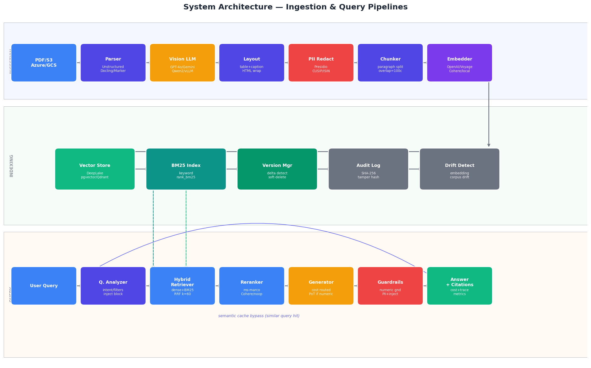

# Architecture Overview



*Full ingestion and query pipeline rendered from the actual component graph.*

```
PDF/S3/Azure --> Parser --> Layout Grouper --> PII Redactor
                       \--> Vision LLM --------/
                                               |
                                    Embedder + BM25
                                               |
                                     Vector Store
                                               |
    Query --> Query Analyzer --> Hybrid Retriever (RRF)
                                               |
                                    Cross-Encoder Reranker
                                               |
                                    LLM Generator (cost-routed)
                                               |
                                    Guardrails (numeric + injection)
                                               |
                                    Grounded Answer + Citations
```

All components implement ABCs from `components/base.py` and are wired via dependency injection.
Swap any component (parser, vector store, LLM) by changing one config value.
