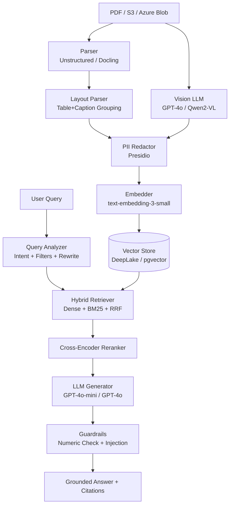

# RAG Financial Multimodal

**Enterprise-grade multimodal RAG for financial document analysis.**

> Parse → Vision → Embed → Retrieve → Generate → Guard → Cite

---

## Why This Exists

Financial documents are mixed-media: narrative text, tables, charts, footnotes, cross-references. Standard RAG pipelines fail on charts and hallucinate numbers. This system solves that with:

- **GPT-4o / Qwen2-VL** vision extraction — every chart yields exact axis values and data points
- **Hybrid RRF retrieval** — dense + BM25 catches both semantic matches and exact figures
- **Program-of-Thought calculator** — arithmetic is computed, not guessed
- **Numeric guardrails** — every number in the answer is verified against source context
- **Multi-tenancy** — per-tenant vector isolation, rate limits, token quotas, audit trail

---

## Quickstart

```bash
# Docker (recommended)
git clone https://github.com/your-org/rag-financial-multimodal
cd rag-financial-multimodal
cp .env.example .env   # set OPENAI_API_KEY
docker compose up

# Query
curl -X POST http://localhost:8000/api/v1/query \
  -H "Content-Type: application/json" \
  -d '{"query": "What was gross margin in Q3 2023?"}'
```

See [Quickstart → Docker](quickstart/docker.md) for the full walkthrough.

---

## Key Features

| Feature | Status |
|---|---|
| GPT-4o + Qwen2-VL vision | ✅ |
| Layout-aware chunking (tables + captions) | ✅ |
| Hybrid RRF retrieval + cross-encoder reranking | ✅ |
| Program-of-Thought sandboxed calculator | ✅ |
| Numeric grounding guardrail | ✅ |
| PII redaction (Presidio + financial patterns) | ✅ |
| Multi-tenancy with quotas | ✅ |
| OpenTelemetry + Prometheus + Grafana | ✅ |
| FastAPI REST + Python SDK + CLI | ✅ |
| Docker + Kubernetes + Helm | ✅ |
| RAGAS evaluation + CI regression gate | ✅ |
| Document versioning + delta detection | ✅ |
| S3 / Azure Blob connectors | ✅ |

---

## Architecture


